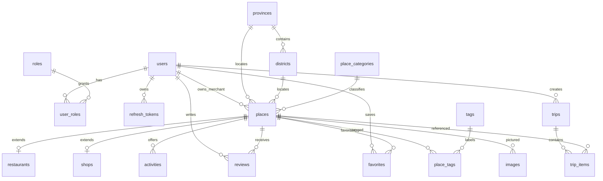

# Database Schema — PostgreSQL 16 + PostGIS

> 14 entities ตาม spec. ทุกตารางเป็น `snake_case`, PK เป็น `UUID` (ยกเว้น lookup tables ใช้ serial), timestamp เป็น `TIMESTAMPTZ`.

## ER Overview (Mermaid)



**Design note — Restaurants/Shops**: เป็น *extension table* 1:1 กับ `places` (FK = PK = `place_id`) โดย `places.kind ∈ {attraction, restaurant, shop}`. ทำให้ geo-search/rating/รูป รวมศูนย์อยู่ที่ `places` ตารางเดียว แต่เก็บ attribute เฉพาะทาง (cuisine, shop_type) แยก — เลี่ยง NULL เยอะแบบ single-table และเลี่ยง join หลายชั้นแบบแยกขาด.

## DDL

```sql
-- ===== Extensions =====
CREATE EXTENSION IF NOT EXISTS postgis;
CREATE EXTENSION IF NOT EXISTS pg_trgm;     -- fuzzy/text search
CREATE EXTENSION IF NOT EXISTS citext;      -- case-insensitive email
CREATE EXTENSION IF NOT EXISTS pgcrypto;    -- gen_random_uuid()

-- ===== RBAC =====
CREATE TABLE roles (
  id         SMALLSERIAL PRIMARY KEY,
  code       VARCHAR(20) UNIQUE NOT NULL,        -- traveler|merchant|admin
  name       VARCHAR(50) NOT NULL,
  created_at TIMESTAMPTZ NOT NULL DEFAULT now()
);

CREATE TABLE users (
  id             UUID PRIMARY KEY DEFAULT gen_random_uuid(),
  email          CITEXT UNIQUE NOT NULL,
  password_hash  TEXT,                            -- NULL = google-only
  google_sub     TEXT UNIQUE,
  display_name   VARCHAR(120) NOT NULL,
  avatar_url     TEXT,
  is_active      BOOLEAN NOT NULL DEFAULT TRUE,
  email_verified BOOLEAN NOT NULL DEFAULT FALSE,
  created_at     TIMESTAMPTZ NOT NULL DEFAULT now(),
  updated_at     TIMESTAMPTZ NOT NULL DEFAULT now()
);

CREATE TABLE user_roles (
  user_id UUID NOT NULL REFERENCES users(id) ON DELETE CASCADE,
  role_id SMALLINT NOT NULL REFERENCES roles(id) ON DELETE RESTRICT,
  PRIMARY KEY (user_id, role_id)
);

CREATE TABLE refresh_tokens (
  id          UUID PRIMARY KEY DEFAULT gen_random_uuid(),
  user_id     UUID NOT NULL REFERENCES users(id) ON DELETE CASCADE,
  token_hash  TEXT NOT NULL,                      -- เก็บ hash เท่านั้น
  expires_at  TIMESTAMPTZ NOT NULL,
  revoked_at  TIMESTAMPTZ,
  replaced_by UUID REFERENCES refresh_tokens(id),
  user_agent  TEXT,
  ip          INET,
  created_at  TIMESTAMPTZ NOT NULL DEFAULT now()
);
CREATE INDEX ix_refresh_user ON refresh_tokens(user_id);

-- ===== Geography lookup =====
CREATE TABLE provinces (
  id       SERIAL PRIMARY KEY,
  code     VARCHAR(10) UNIQUE,
  name_th  VARCHAR(120) NOT NULL,
  name_en  VARCHAR(120),
  centroid geography(Point,4326),
  geom     geography(MultiPolygon,4326)
);

CREATE TABLE districts (
  id          SERIAL PRIMARY KEY,
  province_id INT NOT NULL REFERENCES provinces(id) ON DELETE CASCADE,
  code        VARCHAR(10),
  name_th     VARCHAR(120) NOT NULL,
  name_en     VARCHAR(120),
  centroid    geography(Point,4326),
  geom        geography(MultiPolygon,4326)
);
CREATE INDEX ix_districts_province ON districts(province_id);

CREATE TABLE place_categories (
  id         SERIAL PRIMARY KEY,
  code       VARCHAR(40) UNIQUE NOT NULL,
  name_th    VARCHAR(120) NOT NULL,
  name_en    VARCHAR(120),
  icon       VARCHAR(40),
  sort_order SMALLINT DEFAULT 0
);

-- ===== Core POI =====
CREATE TABLE places (
  id            UUID PRIMARY KEY DEFAULT gen_random_uuid(),
  category_id   INT  REFERENCES place_categories(id),
  province_id   INT  REFERENCES provinces(id),
  district_id   INT  REFERENCES districts(id),
  owner_id      UUID REFERENCES users(id),            -- merchant (nullable)
  kind          VARCHAR(20) NOT NULL DEFAULT 'attraction',  -- attraction|restaurant|shop
  name          VARCHAR(200) NOT NULL,
  slug          VARCHAR(220) UNIQUE,
  description   TEXT,
  address       TEXT,
  phone         VARCHAR(40),
  website       TEXT,
  location      geography(Point,4326) NOT NULL,
  rating_avg    NUMERIC(2,1) NOT NULL DEFAULT 0,
  rating_count  INT NOT NULL DEFAULT 0,
  price_level   SMALLINT CHECK (price_level BETWEEN 1 AND 4),
  status        VARCHAR(20) NOT NULL DEFAULT 'pending', -- pending|approved|rejected|hidden
  opening_hours JSONB,
  created_at    TIMESTAMPTZ NOT NULL DEFAULT now(),
  updated_at    TIMESTAMPTZ NOT NULL DEFAULT now()
);
CREATE INDEX ix_places_location  ON places USING GIST (location);   -- spatial
CREATE INDEX ix_places_name_trgm ON places USING GIN  (name gin_trgm_ops);
CREATE INDEX ix_places_category  ON places(category_id);
CREATE INDEX ix_places_status    ON places(status);
CREATE INDEX ix_places_kind      ON places(kind);

CREATE TABLE restaurants (
  place_id     UUID PRIMARY KEY REFERENCES places(id) ON DELETE CASCADE,
  cuisine      VARCHAR(80)[],
  price_range  VARCHAR(20),
  has_delivery BOOLEAN DEFAULT FALSE,
  menu_url     TEXT
);

CREATE TABLE shops (
  place_id  UUID PRIMARY KEY REFERENCES places(id) ON DELETE CASCADE,
  shop_type VARCHAR(40),                 -- souvenir|market|mall|local
  products  TEXT[]
);

CREATE TABLE activities (
  id           UUID PRIMARY KEY DEFAULT gen_random_uuid(),
  place_id     UUID REFERENCES places(id) ON DELETE CASCADE,
  name         VARCHAR(200) NOT NULL,
  description  TEXT,
  duration_min INT,
  price        NUMERIC(10,2),
  category     VARCHAR(60)
);

-- ===== Tags / Images / Reviews / Favorites =====
CREATE TABLE tags (
  id   SERIAL PRIMARY KEY,
  slug VARCHAR(60) UNIQUE NOT NULL,
  name VARCHAR(80) NOT NULL
);
CREATE TABLE place_tags (
  place_id UUID REFERENCES places(id) ON DELETE CASCADE,
  tag_id   INT  REFERENCES tags(id)   ON DELETE CASCADE,
  PRIMARY KEY (place_id, tag_id)
);

CREATE TABLE images (
  id         UUID PRIMARY KEY DEFAULT gen_random_uuid(),
  owner_type VARCHAR(20) NOT NULL,      -- place|user|review
  owner_id   UUID NOT NULL,
  url        TEXT NOT NULL,             -- GCS object path
  alt        VARCHAR(200),
  is_cover   BOOLEAN DEFAULT FALSE,
  sort_order SMALLINT DEFAULT 0,
  created_at TIMESTAMPTZ NOT NULL DEFAULT now()
);
CREATE INDEX ix_images_owner ON images(owner_type, owner_id);

CREATE TABLE reviews (
  id         UUID PRIMARY KEY DEFAULT gen_random_uuid(),
  place_id   UUID NOT NULL REFERENCES places(id) ON DELETE CASCADE,
  user_id    UUID NOT NULL REFERENCES users(id)  ON DELETE CASCADE,
  rating     SMALLINT NOT NULL CHECK (rating BETWEEN 1 AND 5),
  comment    TEXT,
  ai_summary TEXT,                      -- F11: AI สรุปรีวิว
  created_at TIMESTAMPTZ NOT NULL DEFAULT now(),
  UNIQUE (place_id, user_id)            -- 1 user 1 review ต่อ place
);
CREATE INDEX ix_reviews_place ON reviews(place_id);

CREATE TABLE favorites (
  user_id    UUID REFERENCES users(id)  ON DELETE CASCADE,
  place_id   UUID REFERENCES places(id) ON DELETE CASCADE,
  created_at TIMESTAMPTZ NOT NULL DEFAULT now(),
  PRIMARY KEY (user_id, place_id)
);

-- ===== Trips =====
CREATE TABLE trips (
  id          UUID PRIMARY KEY DEFAULT gen_random_uuid(),
  user_id     UUID NOT NULL REFERENCES users(id) ON DELETE CASCADE,
  title       VARCHAR(200) NOT NULL,
  province_id INT REFERENCES provinces(id),
  start_date  DATE,
  days        SMALLINT NOT NULL DEFAULT 1 CHECK (days BETWEEN 1 AND 30),
  budget      NUMERIC(12,2),
  is_ai       BOOLEAN NOT NULL DEFAULT FALSE,
  ai_meta     JSONB,                    -- prompt, model, tokens, route summary
  status      VARCHAR(20) NOT NULL DEFAULT 'draft',  -- draft|saved|archived
  created_at  TIMESTAMPTZ NOT NULL DEFAULT now(),
  updated_at  TIMESTAMPTZ NOT NULL DEFAULT now()
);
CREATE INDEX ix_trips_user ON trips(user_id);

CREATE TABLE trip_items (
  id           UUID PRIMARY KEY DEFAULT gen_random_uuid(),
  trip_id      UUID NOT NULL REFERENCES trips(id) ON DELETE CASCADE,
  place_id     UUID REFERENCES places(id),
  day_no       SMALLINT NOT NULL DEFAULT 1,
  sort_order   SMALLINT NOT NULL DEFAULT 0,
  start_time   TIME,
  duration_min INT,
  est_cost     NUMERIC(10,2),
  note         TEXT
);
CREATE INDEX ix_trip_items_trip ON trip_items(trip_id, day_no, sort_order);
```

## Derived data / triggers
- `reviews` insert/update/delete → trigger คำนวณ `places.rating_avg`, `rating_count` ใหม่ (หรือทำใน service layer ใน transaction เดียว)
- `updated_at` → trigger `set_updated_at()` ทุกตารางที่มีคอลัมน์นี้

## Common queries
```sql
-- Geo radius search (เร็วด้วย GIST), เรียงตามระยะ
SELECT id, name, ST_Distance(location, :pt) AS dist_m
FROM places
WHERE status='approved'
  AND ST_DWithin(location, :pt, :radius_m)
  AND (:category_id IS NULL OR category_id = :category_id)
ORDER BY dist_m
LIMIT :limit OFFSET :offset;

-- Text search (trigram)
SELECT id, name FROM places
WHERE status='approved' AND name % :q
ORDER BY similarity(name, :q) DESC LIMIT 10;
```
`:pt` = `ST_SetSRID(ST_MakePoint(:lng,:lat),4326)::geography`
